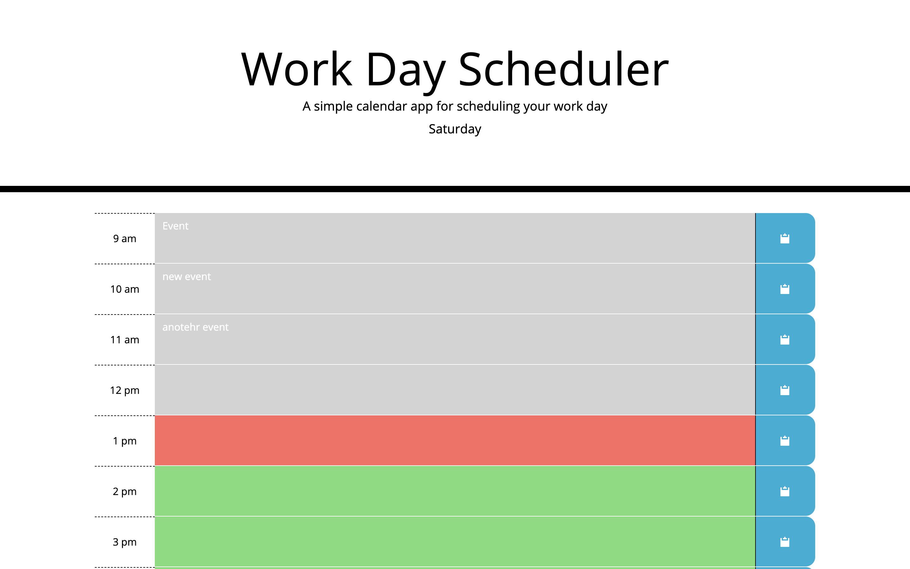

# Work Day Scheduler 

## Purpose
A persistent workday calendar that will allow you to dynamically add and edit events. It should also color-code event blocks depending on if they are past, present, or upcoming.

## Built With
* HTML
* CSS
* JavaScript

## Website
https://sydneywalcoff.github.io/workday

## Screenshot

## Contribution
Made with love by Sydney Walcoff
